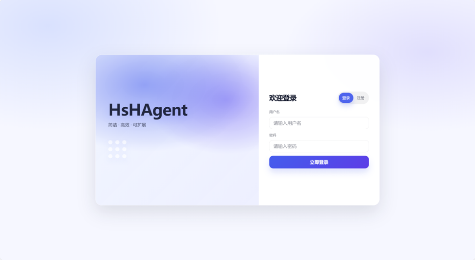
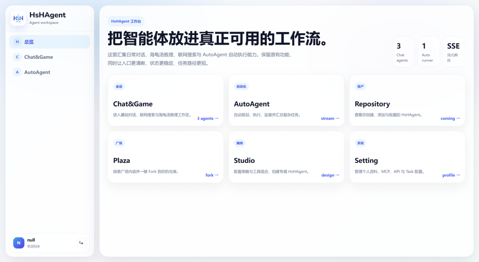
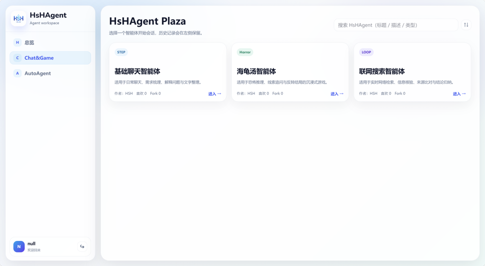
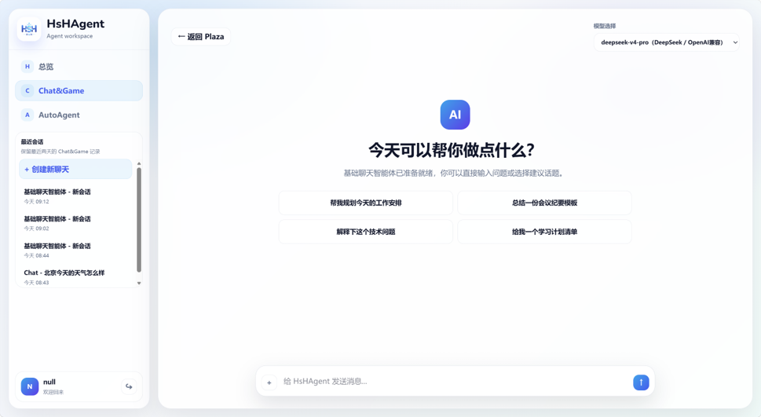
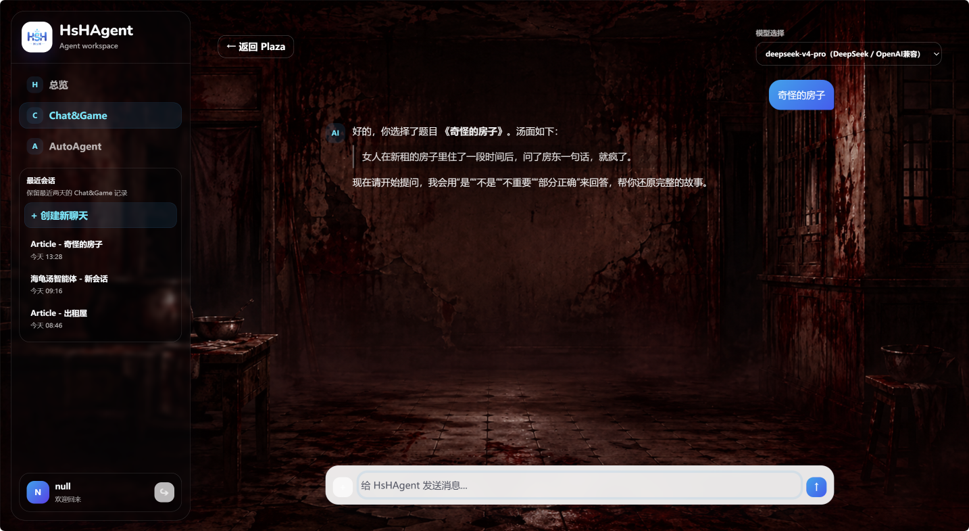
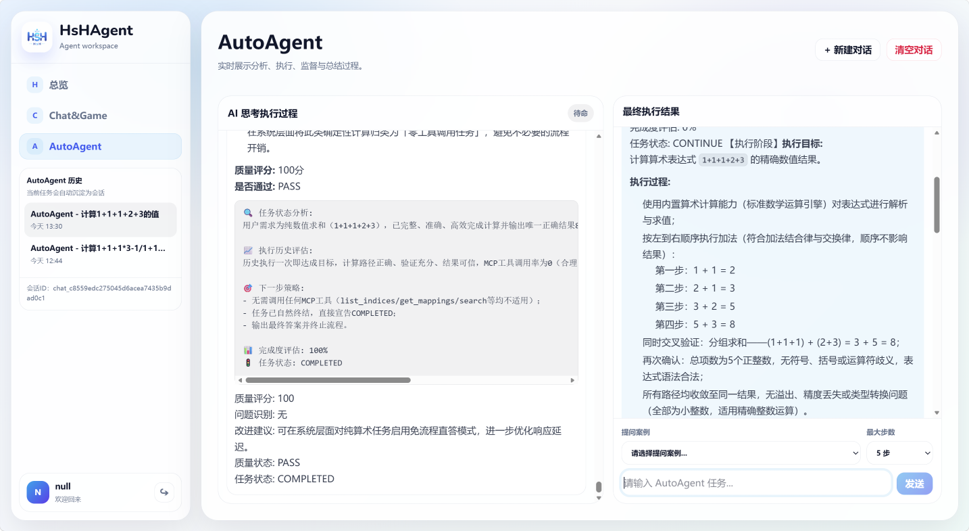

# HsHAgent

HsHAgent 是一个前后端一体的智能体工作台项目，后端基于 Spring Boot 与 Spring AI 构建，前端基于 React + Vite 构建。项目围绕“多智能体对话、知识库增强问答、自动任务执行、会话历史管理、MCP 工具扩展”展开，提供从登录鉴权到流式 AI 交互的完整使用链路。

## 项目功能

### 1. 用户登录与鉴权

- 支持用户注册、登录。
- 登录成功后返回 JWT Token，前端写入 `localStorage` 并在后续请求中携带 `Authorization: Bearer <token>`。
- 后端通过 JWT 拦截器识别当前用户，用于会话、消息和 AutoAgent 执行记录的用户隔离。

> 登录 / 注册页面
>
> 

### 2. HsHAgent 工作台首页

- 提供统一入口，将常用能力组织为工作台卡片。
- 当前前端包含 Chat&Game、AutoAgent、Repository、Plaza、Studio、Setting 等入口，其中 Chat&Game、AutoAgent 已接入主要交互链路。
- 左侧侧边栏承载导航、会话历史、新建对话和退出登录等操作。

> 工作台首页
>
> 

### 3. Chat&Game 多智能体对话

Chat&Game 模块提供多个可选择的智能体入口：

- 基础聊天智能体：用于日常问答、需求梳理、文本整理、技术解释等通用对话。
- 海龟汤智能体：用于海龟汤推理游戏，通过题面、线索追问、克制提示和答案还原完成沉浸式推理体验。
- 联网搜索智能体：用于检索任务拆解、信息核验、来源对比和结构化结论归纳。

前端支持：

- 智能体广场选择。
- 多模型下拉选择。
- 快捷提示词。
- 流式输出展示。
- Markdown 渲染。
- 自动滚动与回到底部。
- 会话历史加载与切换。

后端支持：

- `/model/chat` 普通流式模型对话。
- `/model/chat/knowledge` 知识库增强对话。
- 基于 `sessionId` 的上下文记忆。
- 对用户消息和助手消息进行持久化。

> 智能体广场
>
> 

> 聊天对话页面
>
> 
> 

### 4. 多模型路由

后端通过 `ModelRouteRegistry` 维护模型路由，将前端传入的模型名称映射到对应模型提供方和实际模型。

当前代码中包含的模型路由包括：

- `deepseek-v4-pro`
- `deepseek-r1:1.5b`
- `qwen3.5:4b`
- `qwen3.6-plus`
- `qvq-max-2025-03-25`
- `Qwen3.0-VL`

后端同时配置了：

- Ollama 本地模型调用。
- OpenAI 兼容接口调用。
- 不同模型对应的向量模型和知识库命名空间。

### 5. RAG 知识库增强

项目包含两类知识库相关能力：

- 本地 PGVector 向量检索能力：通过 Spring AI Vector Store 接入 PostgreSQL + pgvector。
- 远程 RAG 检索能力：海龟汤智能体可调用远程 RAG 服务检索题库资料，再结合大模型生成回答。

后端相关能力包括：

- 文档读取与向量化。
- 根据问题执行相似度检索。
- 将检索片段注入系统提示词。
- 结合聊天模型生成中文回答。
- 通过 `/rag/embedding` 预留知识库写入接口。

### 6. AutoAgent 自动任务执行

AutoAgent 是项目中的自动化任务执行模块，前端通过 SSE 实时展示执行过程，后端通过责任链 / 规则树方式拆分执行阶段。

执行过程包含：

- 任务分析：分析当前任务状态、历史执行记录、下一步策略和完成度。
- 精准执行：根据分析结果推进具体任务。
- 质量监督：检查执行质量、发现问题并给出改进建议。
- 执行总结：生成最终总结，输出已完成内容、未完成原因和后续建议。

前端支持：

- 输入任务指令。
- 设置最大执行步数。
- 查看实时阶段事件。
- 查看最终执行结果。
- 新建 / 清空 AutoAgent 对话。
- 加载历史 AutoAgent 会话。

后端支持：

- `/api/v1/agent/auto_agent` SSE 流式接口。
- 线程池异步执行。
- 分阶段事件推送。
- 执行结果持久化到会话消息。

> AutoAgent 执行页面
>
> 

### 7. 会话与消息管理

项目为聊天和 AutoAgent 提供统一的会话管理能力：

- 创建会话。
- 按智能体类型分页查询会话列表。
- 查询指定会话下的消息记录。
- 保存用户消息、助手消息和异常消息。
- 前端侧边栏按智能体类型展示历史会话。

主要接口：

- `POST /session/create`
- `GET /session/list`
- `GET /session/{sessionId}/messages`

### 8. MCP 工具扩展

仓库中包含多个 MCP Server 子模块，用于扩展智能体可调用工具：

- `mcp-server-computer`：获取本机系统、用户、Java 运行环境等电脑配置信息。
- `mcp-server-csdn`：提供发布文章到 CSDN 的工具能力。
- `mcp-server-tieba`：预留贴吧发帖相关工具能力。

主后端工程中提供 MCP Client 配置文件，可按需启用 MCP stdio 工具服务。

## 技术栈

### 后端

- Java 17
- Spring Boot 3.5
- Spring AI
- Spring Web
- Spring AI Ollama
- Spring AI OpenAI
- Spring AI MCP Client / Server
- Spring AI PGVector
- MyBatis
- MySQL
- PostgreSQL + pgvector
- Redis / Redisson
- JWT

### 前端

- React 18
- TypeScript
- Vite
- CSS Modules
- Tailwind 生成脚本
- React Markdown
- SSE / Fetch Streaming

## 项目结构

```text
HsHAgent/
├── HsHAgent/                 # Spring Boot 主后端工程
│   ├── src/main/java          # 控制器、服务、配置、Mapper、实体等
│   └── src/main/resources     # application 配置、MyBatis XML、MCP 配置
├── HsHAgent_web/             # React + Vite 前端工程
│   ├── src/components         # 登录、工作台、Markdown 组件
│   ├── src/workspace          # 工作台页面、配置、类型和工具函数
│   └── src/request            # API 请求封装
├── mcp-server-computer/      # 电脑信息 MCP Server
├── mcp-server-csdn/          # CSDN 发布 MCP Server
├── mcp-server-tieba/         # 贴吧相关 MCP Server
└── README.md
```

## 后端主要接口

| 模块 | 方法 | 路径 | 说明 |
| --- | --- | --- | --- |
| 用户 | `PUT` | `/DaHu/user/login` | 用户登录 |
| 用户 | `POST` | `/DaHu/user/register` | 用户注册 |
| 用户 | `POST` | `/DaHu/user/token` | 手动创建 Token |
| 对话 | `GET` | `/DaHu/model/chat` | 普通智能体流式对话 |
| 对话 | `POST` | `/DaHu/model/chat/knowledge` | 知识库增强流式对话 |
| 会话 | `POST` | `/DaHu/session/create` | 创建会话 |
| 会话 | `GET` | `/DaHu/session/list` | 查询会话列表 |
| 会话 | `GET` | `/DaHu/session/{sessionId}/messages` | 查询会话消息 |
| AutoAgent | `POST` | `/DaHu/api/v1/agent/auto_agent` | 自动任务执行 SSE |
| RAG | `POST` | `/DaHu/rag/embedding/uplod` | 知识库写入接口 |

## 本地运行

### 1. 后端

进入后端目录：

```bash
cd HsHAgent
```

配置运行所需环境变量：

```bash
MYSQL_PASSWORD=你的 MySQL 密码
POSTGRESQL_PASSWORD=你的 PostgreSQL 密码
REDIS_PASSWORD=你的 Redis 密码
OPENAI_API_KEY=你的模型 API Key
JWT_SECRET=你的 JWT 密钥
JWT_ISSUER=你的 JWT 签发方
```

启动后端：

```bash
./mvnw spring-boot:run
```

默认服务地址：

```text
http://localhost:8080/DaHu
```

### 2. 前端

进入前端目录：

```bash
cd HsHAgent_web
```

安装依赖：

```bash
npm install
```

启动开发服务：

```bash
npm run dev
```

## 项目特点

- 前后端围绕统一工作台组织，登录后进入完整智能体使用流程。
- 后端统一提供用户、会话、消息、模型对话、RAG 和 AutoAgent API。
- 前端对普通对话和 AutoAgent 都采用流式读取，提升 AI 响应体验。
- 模型路由与智能体类型解耦，便于后续扩展更多模型和智能体。
- MCP Server 作为独立模块存在，便于按需接入外部工具能力。
